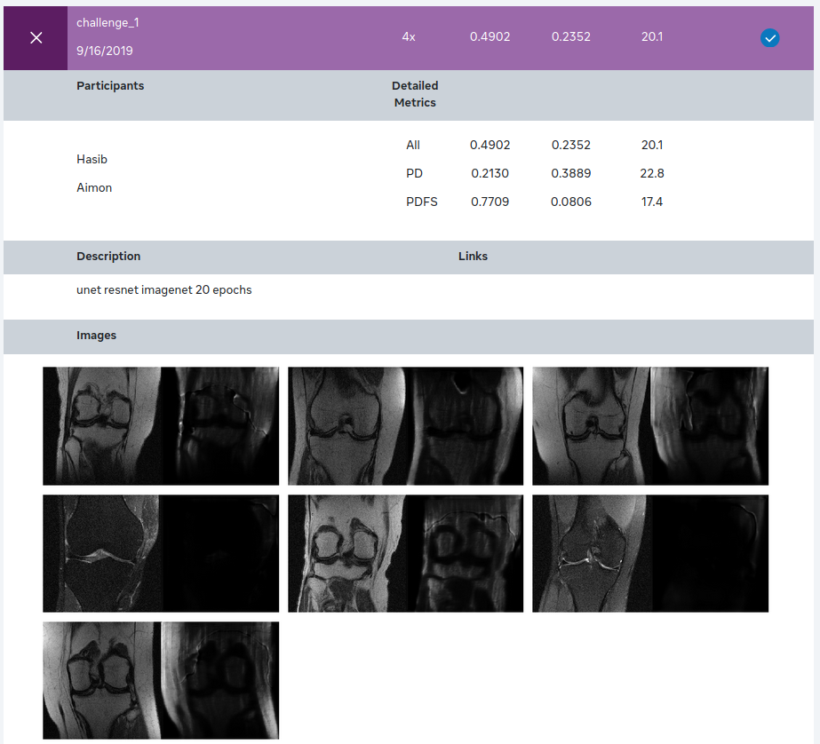

## fastMRI Image Reconstruction Challenge 2019 (Single-coil track)

 | 

The project is structured as follows.

### Challenge description

Given an undersampled knee MRI scan, the goal is to reconstruct a high resolution knee MRI scan. More details about the dataset and task can be found [here](https://fastmri.org/dataset/).


### Our method

We processed the data at the slice level. For each knee MRI low resolution, there was a corresponding high resolution knee MRI. On this processed data, we trained a U-Net architecture with a pretrained ResNet backbone on the knee MRI slices. Refer to [this](https://github.com/hasibzunair/MRI-reconstruction/blob/master/unet.ipynb) notebook for code implementation.

### Dependencies
This work is implemented in Python 3.6 and Keras using Tensorflow as backend.

*    Ubuntu 14.04
*    Python 3.6

### Directory strucuture and usage
* `media` : Contains supporting material for README.md
* `dataset` : training data provided by competition
* `fastMRI` : fastMRI github repository for helpers and utils
* *.ipynb # notebooks and python scripts
* *.py

### Dataset directory strucuture:

```
dataset/
    singlecoil_train/
                # *.h5 files of MRI data
    singlecoil_test_v2/
                # *h5 raw test samples
    # preprocessed
    singlecoil_train_3D_images_48x/
                                low/
                                    # undersampled 3D image volumes
                                high/
                                    # ground truth 3D  image volumes
                           
```

### Challenge Leaderboard 2019

A total of 17 teams came into the final leaderboard, among which we were the last! Some logs are shown below.

<p align="center">
<a href="#"></a>
</p>

### Reference to other models

Some helper scripts are based on https://github.com/facebookresearch/fastMRI.

### License

Your driver's license.


